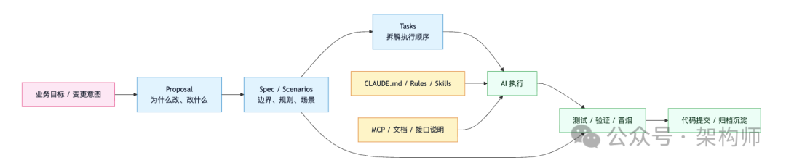
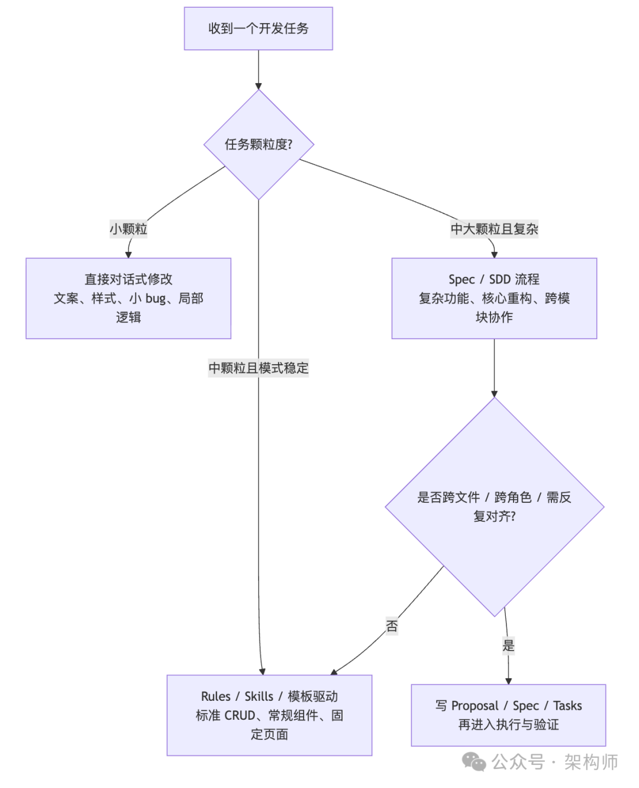

# Spec 不是代码的替代品，它是 AI Coding 的上下文管理层

> 公众号: 架构师
> 发布时间: 2026-03-23 22:54
> 原文链接: https://mp.weixin.qq.com/s/26b3k0tnX_a8mWjOldeE9Q?scene=1

---


架构师（JiaGouX）我们都是架构师！
架构未来，你来不来？

---

最近围绕 Spec 的讨论明显变多。比较有代表性的声音大致有两类：一类更关注 Spec 和代码之间的边界，另一类更关注 Spec 在真实项目协作中的工程价值。这两类观察并不冲突，放在一起看，刚好能把问题看得更完整。

如果把前面几篇内容接起来看，会发现主线很连续。

前面在讲[作业系统](https://mp.weixin.qq.com/s?__biz=MzAwNjQwNzU2NQ==&mid=2650408807&idx=1&sn=0357c897da9913897aa1fa573f212112&scene=21#wechat_redirect)、[上下文税](https://mp.weixin.qq.com/s?__biz=MzAwNjQwNzU2NQ==&mid=2650408183&idx=1&sn=0b6f1437465d3a61118db688cc889b17&scene=21#wechat_redirect)、[Anthropic 的 Skills](https://mp.weixin.qq.com/s?__biz=MzAwNjQwNzU2NQ==&mid=2650408824&idx=1&sn=f8e9dd4bfa0a9ed4db1b5821678c5583&scene=21#wechat_redirect)、[Claude Code 工作流](https://mp.weixin.qq.com/s?__biz=MzAwNjQwNzU2NQ==&mid=2650408802&idx=1&sn=f55babf3496707ba83f34b9a0df47269&scene=21#wechat_redirect)、[仓库工作流](https://mp.weixin.qq.com/s?__biz=MzAwNjQwNzU2NQ==&mid=2650408832&idx=1&sn=ef00408738c853ea2e94be58c0612e51&scene=21#wechat_redirect)，本质上都在回答同一类问题：

**当 AI 真正进入项目之后，怎样把执行、上下文和协作一起管住。**

顺着这条线往下看，Spec 会重新变重要，并不意外。

因为 AI Coding 早就不只是在比"能不能写出代码"了。真正进入团队和项目之后，大家更在意的是另一组问题：

- • 需求有没有讲清楚
- • 改动边界有没有收住
- • 生成结果能不能稳定落地
- • 同一类任务下次还能不能复用

到了这个阶段，Spec 自然会重新回到桌面上。

但如果把它理解成"以后不用怎么写代码了，只要把 Spec 写清楚就行"，这个理解还是太直了。

更贴近工程现实的说法是：

**在 AI Coding 里，Spec 更像上下文管理层。**

它当然和代码有关。

但它最主要的作用，不是替代代码，而是把原本分散在人、文档、会话和仓库里的意图，先收拢成一个可执行、可验证、可沉淀的工作面。

这个位置一旦摆正，很多讨论会更容易展开。

---

## 太长不看版（6 条）

- • Spec 不是所有任务都需要写
- • Spec 的价值不主要在"替代编码"，而在"压缩意图、限定边界、保留决策链"
- • 复杂增量功能、高风险重构、跨角色联调，更适合先做 Spec
- • 小颗粒修改、模式稳定的标准页面，未必需要走完整 Spec 流程
- • Spec 能减少误解和返工，但不能替代验证，也不能替代现场信息
- • 如果把最近这一周的主线接起来看，Spec 更像"上下文工程化"继续往前补的一层

---

## 先把 Spec 放回合适的位置

围绕 Spec 的讨论里，常见有两种期待。

第一种期待是，Spec 会比代码更轻。有一种很诱人的想象：不想再碰那些具体、琐碎的代码了，只想写清楚需求和规则，然后交给 AI，AI 去实现，我来验收。

第二种期待是，只要先写 Spec，后面的过程就会天然更严谨。

这两种期待都能理解，但放到工程现场里，往往没那么简单。

因为一旦你真的希望机器稳定执行，描述就必须足够具体。

要写清楚字段。

要写清楚状态。

要写清楚边界条件。

要写清楚异常路径。

要写清楚哪些能改，哪些不能改。

写到这个程度，Spec 和代码之间的距离已经不远了。

最近有一个很有代表性的案例：某个对外强调“根据一份 `SPEC.md` 完成生成”的项目，真去看那份文档，会发现其中已经包含了大量接近实现层的信息，比如数据库字段定义、并发控制规则、退避公式，甚至接近伪代码的描述。

这类现象说明了一件很现实的事：

**当一份 Spec 需要精确到足以稳定驱动实现时，它往往会不断向代码靠近。**

这并不意味着 Spec 没有价值。

恰恰相反。

它说明了一件更实际的事：

**Spec 的价值，不在于让复杂问题突然变简单。**

**它的价值，在于把复杂问题先整理成一个可执行的表达。**

从这个角度看，Spec 更像一种"中间层"。

它站在业务意图和代码实现之间，负责把原本模糊、分散、口语化的信息，先整理成机器和人都能继续工作的形态。

所以，Spec 不是"更省力的代码"。

它更像"提前做过整理的工作上下文"。

这两个理解的差别很大。

---

## 为什么团队又开始重视 Spec

如果只站在个人写代码的视角，Spec 的存在感未必会很强。

但只要进入多人协作、跨模块修改、长期维护，问题就会变得不一样。

这时候 AI 最容易带来成本的地方，往往不是语法错误。

而是理解偏差。

你给它一个模糊目标，它也会很认真地开始干活。问题是，它一旦朝错方向开始干，后面每一步都可能是在错误前提上叠加正确动作。表面上看很勤奋，实际上在持续制造返工。

比如：

- • 它不知道这个模块为什么这样设计
- • 它不知道哪些约束来自业务，而不是来自表面实现
- • 它不知道这次修改的边界到底停在哪里
- • 它不知道当前任务该继承哪些历史信息，又该忽略哪些旧上下文
- • 它不知道你说的"优化一下"，到底是重构、补丁，还是局部替换

这些问题，本质上都和上下文有关。

模型再强，如果拿到的是一堆散的、旧的、互相冲突的信息，输出也很容易漂。上下文窗口更大不等于更好用，关键在于喂进去的信息是不是干净的。

所以很多团队重新引入 Spec，并不是因为突然更爱写文档了。

更常见的原因是：

**他们需要一个地方，先把这次任务的工作上下文收干净。**

这也是为什么近来的很多工程实践，尤其是围绕 Claude Code、OpenSpec 这类工作流的实践，会把 proposal、spec、tasks、rules、memory、MCP 文档接入放在同一条链路里看。

这些东西看起来形式不同，但作用很接近：

它们都在帮助 AI 少猜一点。

如果把最近这段时间更常见的几类工程做法压缩一下，会更容易看清它们之间的关系：

- • [会话、队列、记忆，在解决"系统怎么持续跑"](https://mp.weixin.qq.com/s?__biz=MzAwNjQwNzU2NQ==&mid=2650408813&idx=1&sn=0105245a59f16fc3e2c52e253ff723e8&scene=21#wechat_redirect)
- • [Prompt Cache](https://mp.weixin.qq.com/s?__biz=MzAwNjQwNzU2NQ==&mid=2650408819&idx=1&sn=f0c65045a197c9a3a6ca5b19faeae4da&scene=21#wechat_redirect)、压缩、裁剪，在解决"上下文怎么不失控"
- • [Skills](https://mp.weixin.qq.com/s?__biz=MzAwNjQwNzU2NQ==&mid=2650408824&idx=1&sn=f8e9dd4bfa0a9ed4db1b5821678c5583&scene=21#wechat_redirect)、脚本、[仓库工作流](https://mp.weixin.qq.com/s?__biz=MzAwNjQwNzU2NQ==&mid=2650408832&idx=1&sn=ef00408738c853ea2e94be58c0612e51&scene=21#wechat_redirect)，在解决"经验怎么稳定复用"
- • 而 Spec，更像是在解决"意图怎么先收拢、边界怎么先讲清楚"

放到 Claude Code + OpenSpec 这类组合里看，这个关系会更清楚：

- • Claude Code 更偏执行与验证
- • OpenSpec 更偏规格化工件与任务边界
- • 两者结合之后，Spec 才不只是文档，而开始成为工作流的一部分

这样放回去看，Spec 就不是突然冒出来的一层。

它更像这条线继续往前之后，很自然会补上的一层。

---

## Spec 真正承担的，是对齐工作

如果把 Spec 在 AI Coding 里的作用再压缩一点，可以概括成三件事：

- • 压缩意图
- • 限定边界
- • 保留决策链

图 1：AI Coding 中的协作层次（简化）



### 压缩意图

真实项目里，意图通常不在一个地方。

一点在需求文档里。

一点在设计稿里。

一点在代码注释里。

一点在飞书评论和聊天记录里。

还有一部分，只在负责人脑子里。

AI 最怕这种情况。因为它拿到的不是"一个完整问题"，而是一堆互相不连的碎片。

Spec 的第一作用，就是把这些碎片先压成一个当前任务可用的版本。

它不追求面面俱到。

它追求的是：这次到底要干什么，先说清楚。

### 限定边界

很多 AI 生成问题，不是因为不会做。

而是因为做多了。

该改 3 个文件，它顺手改了 12 个。

该补一个场景，它顺手重写了半个模块。

该做增量，它沿着重构思路一路走下去。

人在现场时，这些错误有时一眼就能看出来。AI 不行。

Spec 的第二作用，就是提前把边界写明白：

- • 改动范围是什么
- • 哪些接口不能动
- • 哪些行为必须保持兼容
- • 验收标准是什么

这一步做得越清楚，后面的执行越稳定。

### 保留决策链

还有一个经常被低估的价值，是沉淀。

很多 AI 协作的决策，默认都留在会话里。

当次很好用。

过一周再看，几乎很难复原。换个人接手，或者换一个 Agent 再来看，什么都找不到。

proposal、spec、tasks、archive 这一套工件的意义，不只是让过程更"正规"。

它更像是在为以后的人和以后新的 Agent 留一条能继续接手的线索。

这对团队来说，价值往往比一次性的速度提升更稳定。因为前者能积累，后者往往只能截图。

---

## 哪些任务值得先写 Spec

不是所有任务都值得走一遍完整 Spec 流程。

这件事一开始就应该讲清楚。

如果连改个文案、修个样式、补一个显隐逻辑都先 proposal、再 spec、再 tasks，沟通成本很容易高过任务本身。

更合适的做法，是按任务颗粒度来分。

图 2：什么场景该直接对话，什么场景更适合写 Spec



这三档也能和前面几篇形成更自然的配合关系：

- • 直接对话，更适合快速处理局部修改
- • Rules、Skills、模板，更适合模式已经稳定的重复任务
- • Spec，更适合那些信息分散、边界复杂、返工代价更高的变更

近期一些公开的项目复盘也印证了这一点。在一个 10 天左右的真实项目里，三种模式被同时跑通：小需求直接在 Chat 里对话；标准 CRUD 页面交给预设好的 Rules 和模板；真正复杂的功能模块和系统重构，才走完整的 SDD 流程。

### 1. 复杂增量功能

在已有系统里增加一个完整模块，是比较适合先做 Spec 的场景。

因为这类任务往往同时涉及：

- • 旧结构理解
- • 新逻辑补充
- • 接口字段对齐
- • 页面行为定义

只靠对话往前推，AI 很容易在某一步理解偏掉，后面再不断返工。

一个比较直观的例子是：某个“定时任务管理”模块，要对接 6 个后端接口，采用规格驱动协作加文档直连之后，一次性拿到字段、枚举和必填项，6 个接口做到零联调返工。人工指令不到 10 条，代码实现主要由 AI 完成。

如果先把 proposal、spec、tasks 收出来，至少能把任务拆在一个更稳定的问题空间里。

### 2. 高风险重构

重构比新功能更需要边界。

因为新功能做坏了，往往还能回退。

重构做偏了，影响的是现有系统。

这类任务里，最重要的不只是"改什么"。

还有：

- • 什么不能改
- • 迁移顺序是什么
- • 每一步如何验证

另一个比较典型的案例是首页重构：原本一个核心 hook 导出 20 多个方法，主界面组件接收 17 个 props，架构债务很重。通过 Spec 拆成 9 组 34 个子任务，从确认组件归属开始，一步步迁移、更新路径、类型检查、冒烟验证，最终 AI 全程独立执行，人工干预不到 5 条指令。

这些内容写进 Spec，价值会比较直接。

它不替代实现。

但它能显著减少"执行顺序错了"或者"改动外溢"的风险。

### 3. 联调和信息对齐

还有一类非常适合先整理 Spec 的任务，是跨角色联调。

接口字段、枚举值、必填项、状态含义、设计稿行为，这些信息如果散在不同系统里，AI 很容易一边写一边猜。

这时候，把文档、接口说明、规则约束先收进一个可执行上下文里，效率提升往往比单纯换更强的模型更明显。

因为这里真正缺的不是"生成能力"。

而是"信息密度"。

---

## Spec 解决不了什么

把 Spec 放到合适的位置以后，边界反而会更清楚。

它能减少误解。

它能减少返工。

它能提高协作稳定性。

但它解决不了所有问题。

尤其是下面这几类：

### 1. 现场信息缺失

有些问题只发生在 CI、测试环境、线上依赖、跨平台构建里。

本地复现不了，日志也不完整。

还有一个很真实的案例是测试环境构建失败：排查持续了 4 个小时，开了 7 个会话，试了 15 次以上方案。每次分析都能解释当前暴露的问题，但最后发现根因并不是单点，而是多个环境因素叠加在一起。

这种时候，问题的关键不在表达是否清楚。

而在于信息本身就不全。

Spec 不能凭空补出现场。

### 2. 多根因叠加

有些故障不是单点问题。

解决一层，下一层才露出来。

这类问题很考验验证顺序、排查路径和工程经验。

Spec 可以帮助记录过程，但不能直接把复杂性抹平。

### 3. 隐性运行时行为

还有一些问题，根因藏在依赖源码、安装脚本或者平台差异里。

文档里没有，代码表面也看不出来。

这时候真正起作用的，还是验证、排查和对环境的理解。

所以更稳妥的说法是：

- • Spec 不能替代代码
- • Spec 不能替代验证
- • Spec 不能替代环境认知
- • Spec 也不能替代工程判断

它更适合处理那些本来就应该被说清楚、但过去常常被含糊带过的部分。

仅此而已。

但仅此而已，已经很值钱了。

---

## 工程师的工作重心，确实在移动

工程师的价值重心，的确在移动。

不是从"写代码的人"变成"只写 Spec 的人"。

而是从偏局部实现，继续往下面这些能力上移动：

- • 问题定义
- • 边界划定
- • 验收设计
- • 上下文整理
- • 异常信号识别

AI 让"把代码敲出来"这件事变快了。

同时也把"任务有没有被定义清楚"这件事放大了。

问题定义不清的时候，AI 不会停下来等你。

它更可能直接把模糊变成实现，把误解变成一串看似忙碌的工作量。

一些实战复盘里有一个很值得保留的观察：AI 更像一个极度服从、执行稳定、但缺少内部业务常识的执行者。规范写得越准确，执行越可靠；规范存在歧义时，系统往往会选择一个“看起来合理”的解释继续往前推进。

所以从这个角度看，Spec 之所以重新变重要，不是因为它更高级。

而是因为它刚好落在了 AI 协作里最容易出问题的那一层。

---

## 写在最后

如果把今天这些讨论压成一句更稳的判断，可以写成这样：

**在 AI Coding 里，Spec 更像上下文管理层。**

它不负责取代代码。

它也不负责替代工程师。

它更像一块工作台。

在正式进入编码之前，团队先把意图、边界、规则和验证方式放到这块台面上。

这样后面的执行，才更容易稳定。

从这个角度看，Spec 的价值并不神秘。

它只是把过去那些靠经验、靠默契、靠会话临时补齐的东西，往前挪了一步，整理了一次。

如果把最近这一周的主线接起来看，这个位置也会更清楚：

- • 作业系统讲的是执行形态
- • 上下文税讲的是运行成本
- • Skills 讲的是经验复用
- • 仓库工作流讲的是协作落地
- • 而 Spec 讲的是意图收敛和边界对齐

它不是孤零零的一篇新概念。

它更像这条线继续往前之后，一个迟早要补上的工程环节。

回到团队实践里，一个更容易落地的判断方式是：

- • 哪些任务已经形成稳定模式，适合直接走模板和规则
- • 哪些任务边界复杂、返工成本高，更适合先写清楚意图和验收标准

很多时候，Spec 是否值得写，并不取决于它是否完整，而取决于它能不能提前把返工点暴露出来。

---

## 把前几篇放到一起看

如果你有兴趣把最近这几篇连起来看，会发现它们其实在讲同一条线：

| 篇目 | 核心关键词 | 和这篇的关系 |
| --- | --- | --- |
| 近期关于 [Prompt Cache](https://mp.weixin.qq.com/s?__biz=MzAwNjQwNzU2NQ==&mid=2650408819&idx=1&sn=f0c65045a197c9a3a6ca5b19faeae4da&scene=21#wechat_redirect)的文章 | **缓存纪律** | Spec 的上下文开销直接受缓存架构影响，喂进去多少决定能省多少 |
| 近期关于 [Anthropic Skills](https://mp.weixin.qq.com/s?__biz=MzAwNjQwNzU2NQ==&mid=2650408824&idx=1&sn=f8e9dd4bfa0a9ed4db1b5821678c5583&scene=21#wechat_redirect)的文章 | **经验复用** | Skills 解决的是模式稳定的重复任务，Spec 解决的是模式不稳定的复杂变更 |
| 近期关于[智能体观察](https://mp.weixin.qq.com/s?__biz=MzAwNjQwNzU2NQ==&mid=2650408480&idx=1&sn=5821c745dd33c781530ab273ab44cdce&scene=21#wechat_redirect)方式的文章 | **动作空间** | 工具设计决定 AI 能做什么，Spec 决定 AI 该做什么、不该做什么 |
| 近期关于 [Claude Code 工程最佳实践](https://mp.weixin.qq.com/s?__biz=MzAwNjQwNzU2NQ==&mid=2650408788&idx=1&sn=ffed2fec07f79e5a64029a02fff0f600&scene=21#wechat_redirect)的文章 | **控制面分层** | Spec 是控制面里负责意图对齐的那一层 |
| 近期关于反馈回路的文章 | **反馈回路** | Spec 里的验收标准，正是反馈回路能闭合的前提 |
| 近期关于[AI Memory](https://mp.weixin.qq.com/s?__biz=MzAwNjQwNzU2NQ==&mid=2650408756&idx=1&sn=03188bfa5d034a1b5ca0347c72b673fd&scene=21#wechat_redirect) 的文章 | **记忆分层** | Spec 归档后沉淀的决策链，本质上是一种结构化的长期记忆 |

放在一起看就更清楚：**Spec 不是一个孤立的概念，它是整套上下文工程体系里的一个关键环节。** 意图怎么收、边界怎么限、决策怎么留——每个问题都能在这些文章里找到对应的工程思路。

---

## 参考资料

1. 1. 一篇关于规格与实现关系的原文博客
   https://haskellforall.com/2026/03/a-sufficiently-detailed-spec-is-code
2. 2. 若干公开的工程实践复盘与项目总结材料


如喜欢本文，请点击右上角，把文章分享到朋友圈
如有想了解学习的技术点，请留言给若飞安排分享

**因公众号更改推送规则，请点“在看”并加“星标”第一时间获取精彩技术分享**

**·END·**

```
```
相关阅读：


- Claude Skills 入门：把“会用 AI”变成“可复制的工程能力”
- 一套可复制的 Claude Code 配置方案：CLAUDE.md、Rules、Commands、Hooks
- Claude Code 最佳实践：把上下文变成生产力（团队可落地版）
- 把 AI 当成新同事：Agent Coding 的上下文与验证体系
- 一周写百万行的背后：Cursor长时间运行 Agent 的工程方法论
- 2026年生活重启指南
- 我真不敢相信，AI 先加速的是工程师。
- 扒一扒 Claude Cowork 系统提示词：Anthropic 如何打造数字同事
- Cowork 安全架构深度解析：从 Claude Code 到 Cowork，Anthropic 如何把“可控”做成产品
- Anthropic官方万字长文：AI Agent评估的系统化方法论
- 银弹还是枷锁？Claude Agent SDK 的架构真相
- Claude Code创始人亲授13条使用技巧
- Claude Code 内部工具开源 code-simplifier：终结 AI 屎山代码的终极方案
```
```

> 版权申明：内容来源网络，仅供学习研究，版权归原创者所有。如有侵权烦请告知，我们会立即删除并表示歉意。谢谢!

**架构师**

我们都是架构师！


****关注**架构师(JiaGouX)，添加“星标”**

**获取每天技术干货，一起成为牛逼架构师**

**技术群请****加若飞：****1321113940****进架构师群**

投稿、合作、版权等邮箱：**admin@137x.com**


