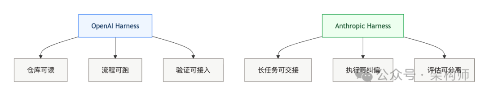
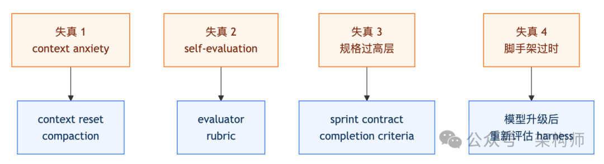
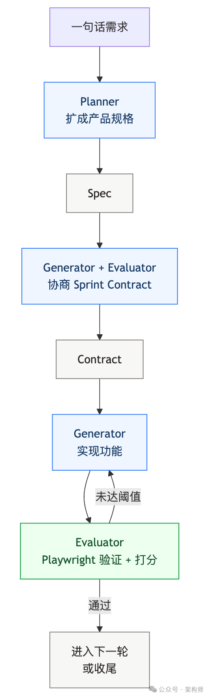

# 如何让单个 Agent 做长任务不失真：Anthropic 给出了一套更工程化的答案

> 公众号: 架构师
> 发布时间: 2026-03-26 22:57
> 原文链接: https://mp.weixin.qq.com/s/irjmZKe3O7HSs9cU7yHzkA

---


架构师（JiaGouX）我们都是架构师！
架构未来，你来不来？

#

---

前面我们拆过 [OpenAI 的 Harness 文章](https://mp.weixin.qq.com/s?__biz=MzAwNjQwNzU2NQ==&mid=2650408765&idx=1&sn=62bc37d9672262334fa3aa5d7c77d8f4&scene=21#wechat_redirect)，重点是把仓库、文档、CI 做成 Agent 能用的工作环境。

Anthropic 这份《Harness design for long-running application development》补的是另一半：

**当 Agent 真开始连续跑几个小时，怎么避免它越跑越偏、越写越自我感觉良好。**

同样都叫 Harness，一个管环境，一个管运行时。OpenAI 更像“把路修平”，Anthropic 更像“给车装方向盘、刹车和仪表盘”。

最近围绕原文的转述已经不少，抓得最多的词是“GAN 式多代理”“上下文重置”“主观任务可打分”。这些点都成立，但如果文章只停在这里，还是一张架构海报。

这篇文章想往下多走一层：**失真到底发生在哪，Anthropic 把哪些失真外移成了系统机制，这些机制什么时候值得用、什么时候应该拆掉。**

---

## 太长不看版

- • 原文真正要解决的不是“多 Agent 不多 Agent”，而是两个失真源：`context anxiety`（上下文焦虑）和 `self-evaluation`（自我评估偏差）。
- • `planner / generator / evaluator` 只是表面形式，底层思想是把“执行”和“挑刺”从一个 Agent 身上拆开。
- • 其中最承重的不是三代理本身，而是 sprint contract（验收协议）和 rubric（评分准绳）——前者把“完成标准”物化成协议，后者把主观质量压成可打分维度。
- • 脚手架不是越多越好。Anthropic 自己在模型升级后就开始系统性地拆掉 Sprint 结构，再观察性能有没有下降。
- • 从 Skills 到 Harness，Anthropic 一直在做同一件事：缩小“必须靠模型自觉”的那部分面积。

先看一张总览图，会更容易抓住 OpenAI 和 Anthropic 这两套 Harness 分别在补哪一层：



---

## 第一个问题：失真发生在哪

Anthropic 看到的不是一个抽象的“Agent 不稳定”，而是两类非常具体的失真。

### 失真 1：上下文越长，越容易提前收工

原文用了一个词叫 `context anxiety`。

意思不是模型“忘了”，而是它在接近自己感知中的上下文边界时，会开始下意识地收尾。任务还没真正做完，它已经进入“差不多可以交卷了”的状态。

**长任务最怕的，不是单次答错，而是持续执行时的目标漂移。**

原文里一个很关键的信号，是它明确把 `context reset` 和 `compaction` 区分开了。

- • `compaction` 是在原会话里压缩历史
- • `context reset` 是彻底起一个新的 Agent，再用结构化工件做交接

更贴近工程的说法是：有些问题，压缩历史还不够，得把会话本体也一起换掉。

### 失真 2：模型做完事以后，天然倾向于夸自己

让模型评价自己产出的东西，它通常会偏正面，即使在人类看来质量只是一般。

在前端设计这种主观任务里，这个问题特别明显。UI 能跑，不代表设计有辨识度。页面看起来完整，不代表它真的有产品感。而一旦进入编码场景，模型依旧可能把“能运行”误判成“已经达标”，把“没有报错”误判成“已经够好”。

Anthropic 的做法不是抽象地说“主观任务也能量化”，而是拿出了具体方法。它把审美拆成 4 个可打分的维度：`design quality`（设计质量）、`originality`（原创性）、`craft`（工艺水平）、`functionality`（功能性）。然后刻意把前两者的权重拉高——因为模型默认在工艺和功能性上往往不差，真正缺的是“别太像 AI 套模板”。

evaluator 不是对着截图打分，而是通过 Playwright MCP 实际点进页面、截图、浏览、操作，然后逐项评估。为了防止评分漂移，还用了 few-shot 校准——先给 evaluator 看几组带详细打分拆解的范例，确保它的判断锚定在具体标准上。

两类失真合起来看，Anthropic 真正在解决的问题就很清楚了：

**不是让 Agent 更能干，而是让它在长时间干活时，别太早收工，也别太轻易原谅自己。**

把原文里的失真源和对应机制并排看，会更直观：



---

## 第二个问题：怎么拆

原文里最容易被转成海报的一张图，就是 `planner / generator / evaluator` 这套结构。但如果站在架构视角，我更在意的不是它有几个 Agent，而是分工背后的三个设计决策。

### 决策 1：规划只管交付物，不管实现细节

`planner` 把一句话需求扩成可执行规格，但它故意只约束产品上下文和高层技术方向，不抢 generator 的低层实现决策。

为什么？因为一旦前置 spec 把技术细节写死且写错，后面的错误会被系统性级联放大。planner 更关注“做什么”和“做到什么程度”，把“怎么做”留给 generator 在动手时自己定。

原文里还有个很硬的细节：planner 在生成 RetroForge 的规格说明时，直接读取了 Anthropic 自己开源的 `frontend design skill`，把其中沉淀的设计原则提炼进 spec，形成了整个应用的视觉设计语言。这意味着 Skills 和 Harness 不是两条平行线，而是在这里汇合了——Skills 负责把方法论装进系统，Harness 负责让长任务沿着这些方法论持续执行。

### 决策 2：执行和判断拆到两个主体上

**让模型既当运动员又当裁判，最后大概率谁都做不好。**

所以 `generator` 只管动手实现，`evaluator` 像一个挑剔 reviewer 一样去验证、打分、挑刺。分离本身不能消除宽容倾向——evaluator 依然是一个对 LLM 生成内容天然宽容的 LLM。但原文说得很直白：调校一个独立的评估器使其保持怀疑态度，远比让生成器对自身作品保持批判性要容易得多。

### 决策 3：验收协议物化成文件，不靠口头对齐

这是我认为最承重的一层。

在每个 Sprint 开始前，generator 和 evaluator 会先协商一份 `sprint contract`（验收协议）：这轮做到什么算完成、怎么验证算完成。generator 提出要构建什么以及如何验证成功，evaluator 审查提案，双方反复对齐直到达成一致。通信不是聊天式的，而是通过文件来回写。

验收也不是“感觉还行”。每个维度都有硬阈值，任何一项低于阈值，这个 Sprint 就判定失败，generator 收到详细的问题反馈，退回重做。evaluator 的验收覆盖 UI 功能、API 端点和数据库状态——不只是“看起来像完成了”。

Sprint contract 解决的，是 spec 太高层、验收太主观之间的断层。

这套结构真正承重的部分，不是三个角色本身，而是下面这条闭环：



---

## 第三个问题：这套结构真的有效吗

很多同类文章讲到这里就停在“架构设计很聪明”。原文相对扎实的一点，是它给了可对照的结果。

**RetroForge（V1 harness，Opus 4.5）：**

同一个 prompt 下，单 Agent 版本大约 20 分钟、9 美元；完整 harness 版本大约 6 小时、200 美元。成本差距接近 20 倍。

但质量差距更直接：单 Agent 版本初看能用，往下点会发现游戏核心链路断着，实体能摆出来，却跑不起来。完整 harness 版本虽然也不完美，但核心功能是可用的。

更关键的是，评估器给出的反馈不是“感觉还有问题”，而是这种能直接进入修复的描述：

- • 矩形填充工具只在拖拽起点和终点放地砖，没有填满区域
- • 删除实体出生点的条件判断写偏了，点击实体时并没有进入可删除状态
- • `PUT /frames/reorder` 被路由顺序挡住了，FastAPI 把 `reorder` 当成了 `frame_id`

**评估开始从泛泛而谈，变成了一种能直接驱动下一轮生成的输入。**

**DAW（V2 harness，Opus 4.6）：**

这时 Anthropic 已经开始简化脚手架——去掉 Sprint 结构，让生成器长时间连续工作。整次运行大约 3 小时 50 分钟、124.70 美元，其中生成器第一轮连续跑了 2 小时 7 分钟。

即便在更强模型、更少脚手架的条件下，QA 代理依然抓到了不少“看起来像完成了，其实还差最后一公里”的问题：

- • 时间线上的片段不能拖动
- • 乐器控制面板还只是展示层
- • 效果器还是数字滑块，没有图形化编辑
- • 音频录制按钮能切换，但并没有真正采集麦克风

**模型能力变强以后，脚手架会减；但“最后一公里的挑刺”并不会自动消失。**

---

## 第四个问题：什么时候该拆掉脚手架

这是原文里我觉得比“三代理架构”更有信息量的部分。

Anthropic 不是一开始就笃定“这套结构永远最优”，而是在持续问另一个问题：

**这个组件之所以存在，是不是因为当前模型还做不到；如果模型变强了，它是不是已经不再承重。**

演化路线压成表更直观：

| 阶段 | 旧版 harness | V1（Opus 4.5） | V2（Opus 4.6） |
| --- | --- | --- | --- |
| 核心问题 | 多会话编码的连贯性 | 长任务中的失真与自我评估偏差 | 在不掉性能的前提下简化脚手架 |
| 任务推进方式 | 一次做一个 feature | generator 按 Sprint 推进 | Sprint 被移除，生成器长时间连续工作 |
| 上下文治理 | context reset 很关键 | 连续会话 + compaction | 随模型变强，脚手架进一步减配 |
| 评估方式 | 更偏任务完成 | evaluator 独立打分 | QA 仍保留，但是否介入更看任务边界 |

原文明确说，evaluator 是否 load-bearing（承重），取决于任务是否超出模型当前 solo 能力的边界。在 Opus 4.5 上，这条边界很近，evaluator 几乎每轮都在发挥作用；到了 4.6，模型能力外扩，很多原来需要评估器把关的任务已经在生成器的独立能力范围之内。

这个态度很像成熟团队看中间层的方式：能证明还在提供增益，就留；不能，就拆。

**好的 Harness 不是不断叠加，而是持续重估。**

---

## 回到更大的画面：Anthropic 到底在搭什么

如果把前面几篇 Skills 和这篇 Harness 放在一起看，Anthropic 的工程哲学其实始终没变：**不要把所有稳定性都寄托在模型当下这一轮临场发挥上。**

Skills 解决“怎么做”——团队经验怎么按需注入。Harness 解决“做得对不对”——长任务过程怎么纠偏。

如果再从 Claude Code Auto Mode 的视角往上看一层，会发现 Anthropic 其实在做一整套运行时分层：

| 层 | 机制 | 解决什么 |
| --- | --- | --- |
| 常驻约束层 | `CLAUDE.md` / rules | 长期约束、身份与边界 |
| 方法加载层 | Skills | 按需注入知识与方法 |
| 确定性控制层 | Hooks / 权限管线 | 不该靠模型判断的事 |
| 长任务运行时层 | Harness | 交接、纠偏、验收 |
| 行动风控层 | Auto Mode / 安全分类器 | 什么能做、什么不能做 |

它不是在堆更多 Agent，而是在把不同类型的判断拆到不同的控制层里。

**Anthropic 在做的，不是堆更多 Agent，而是在不断缩小“必须靠模型自觉”的那部分面积。**

---

## 写在最后

所以我看完后的判断，不是“多 Agent 更厉害了”，而是另一句更朴素的话：

**AI 写得快，从来不是最难的。难的是让它在连续几小时的执行里，依然沿着同一个目标往前走。**

这也是整套设计最值得反复回看的地方。

---

## 参考文章

- • Anthropic, *Harness design for long-running application development*, 2026-03-24
- • OpenAI, *Harness engineering: leveraging Codex in an agent-first world*, 2026-02-11

如喜欢本文，请点击右上角，把文章分享到朋友圈
如有想了解学习的技术点，请留言给若飞安排分享

**因公众号更改推送规则，请点“在看”并加“星标”第一时间获取精彩技术分享**

**·END·**

```
```
相关阅读：


- Claude Skills 入门：把“会用 AI”变成“可复制的工程能力”
- 一套可复制的 Claude Code 配置方案：CLAUDE.md、Rules、Commands、Hooks
- Claude Code 最佳实践：把上下文变成生产力（团队可落地版）
- 把 AI 当成新同事：Agent Coding 的上下文与验证体系
- 一周写百万行的背后：Cursor长时间运行 Agent 的工程方法论
- 2026年生活重启指南
- 我真不敢相信，AI 先加速的是工程师。
- 扒一扒 Claude Cowork 系统提示词：Anthropic 如何打造数字同事
- Cowork 安全架构深度解析：从 Claude Code 到 Cowork，Anthropic 如何把“可控”做成产品
- Anthropic官方万字长文：AI Agent评估的系统化方法论
- 银弹还是枷锁？Claude Agent SDK 的架构真相
- Claude Code创始人亲授13条使用技巧
- Claude Code 内部工具开源 code-simplifier：终结 AI 屎山代码的终极方案
```
```

> 版权申明：内容来源网络，仅供学习研究，版权归原创者所有。如有侵权烦请告知，我们会立即删除并表示歉意。谢谢!

**架构师**

我们都是架构师！


****关注**架构师(JiaGouX)，添加“星标”**

**获取每天技术干货，一起成为牛逼架构师**

**技术群请****加若飞：****1321113940****进架构师群**

投稿、合作、版权等邮箱：**admin@137x.com**


