# Claude Code源码泄露7小时：8大新功能/26个隐藏指令/6级安全架构，全被扒光了

> 公众号: 量子位
> 发布时间: 2026-04-01 00:02
> 原文链接: https://mp.weixin.qq.com/s/cJGWji1XeOEXgYGvIxGCtA

---

##### 梦晨 发自 凹非寺 量子位 | 公众号 QbitAI

听说Claude Code源码泄露了，我起手就是一个git clone！

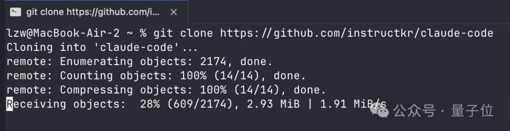

备份库instructkr/claude-code瞬间就获得了2w+星。

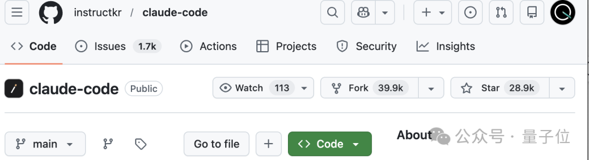

事情很魔幻，Claude Code发新版本v2.1.88的时候，一个60MB的**source map**文件被意外打包进了npm发布包里。

后果很严重，1906个源文件完整暴露，51万行代码，全部可读。

甚至可以做到让Claude Code自己解读自己：

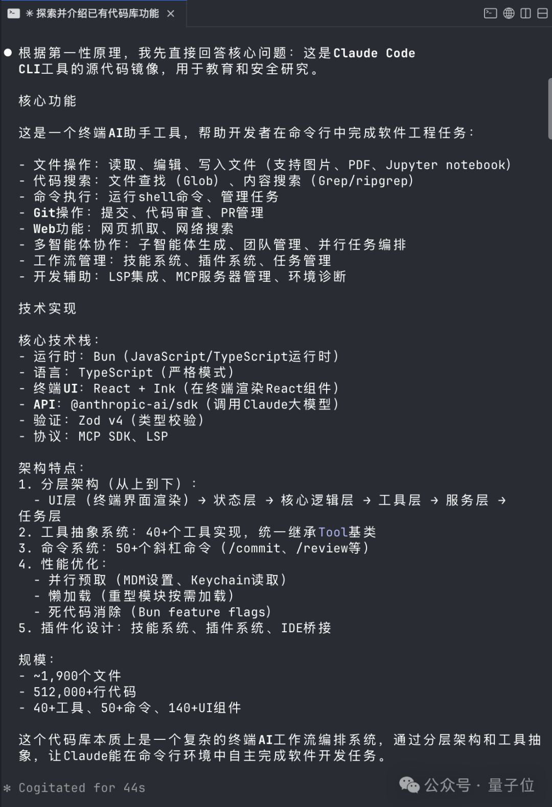

好嘛，Claude团队这下被迫比OpenAI更加Open了。

那么问题来了，source map是个啥？为啥就全泄露了？

它本来是开发调试用的映射文件，能把压缩后的代码还原成原始源码，划重点了，**它 绝 对 不 该 出 现 在 发 布 包 里**。

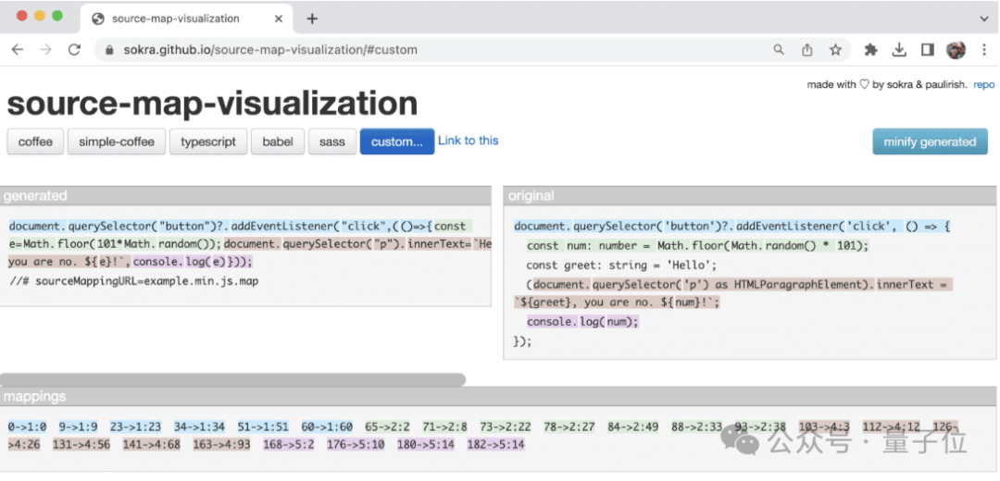

这要是个一般的Web项目也就罢了，在npm里泄露个前端，别人也就抄抄设计和交互逻辑，核心业务流程都在后端。

但坏就坏在他是个Coding CLI工具，大家最馋的功能都在都跑在用户本地的客户端里。

换句话说，任何有心人拿到这套代码，都能复制一个出来。

评论区有人说在6个月内复制，只能说他还是太保守了。

这下可好，泄露代码被眼尖手快的群众迅速备份到多个GitHub仓库，全网使劲研究。

7个小时过去了，大家给代码扒了个底朝天，发现：

8大新功能，26+新指令，6级安全架构，还有愚人节彩蛋。

整个项目架构很优秀，但架不住代码里也有屎山～

## 新功能：电子宠物、长期记忆助手、30分钟深度规划

代码里不只有已上线的功能。社区很快发现了大量被feature flag关闭的隐藏模块。

有人专门搭建了ccleaks.com来展示所有隐藏内容。

从代码中提取出35个编译时特性标志、120多个隐藏环境变量、200多个远程控制开关。

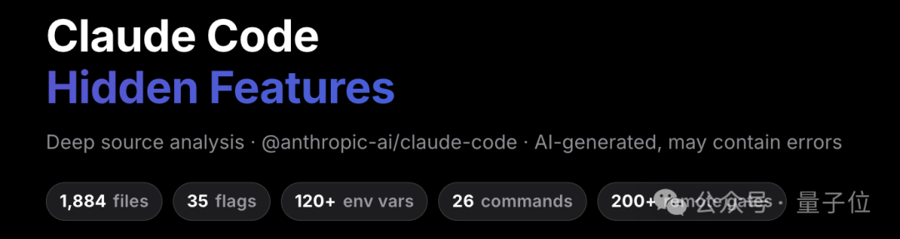

最出人意料的发现之一：Claude Code里藏了一个电子宠物系统。

代号Buddy。一个Tamagotchi风格的ASCII虚拟宠物，会出现在你的终端。

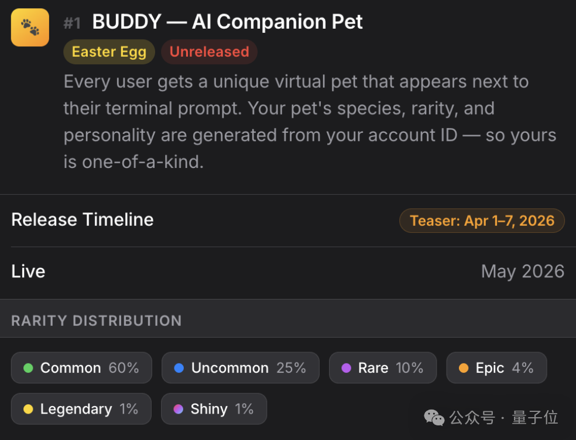

18种物种——鸭子、章鱼、水豚、蘑菇……6种稀有度，普通款占60%，传奇款仅1%，甚至还有闪光款的设定。

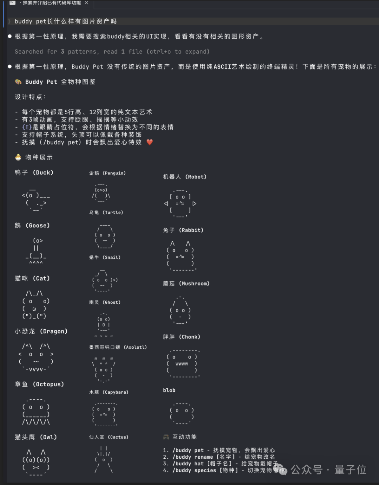

每个用户的宠物由账户ID唯一生成。上号抽卡，你的那只，全世界独一份。

不过嘛，从代码中的时间戳来看，Buddy计划4月1日首次亮相。大概率是个愚人节彩蛋。

接下来，要上正经的了。

代号Kairos，一个持久化助手模式，让Claude拥有跨会话的长期记忆。

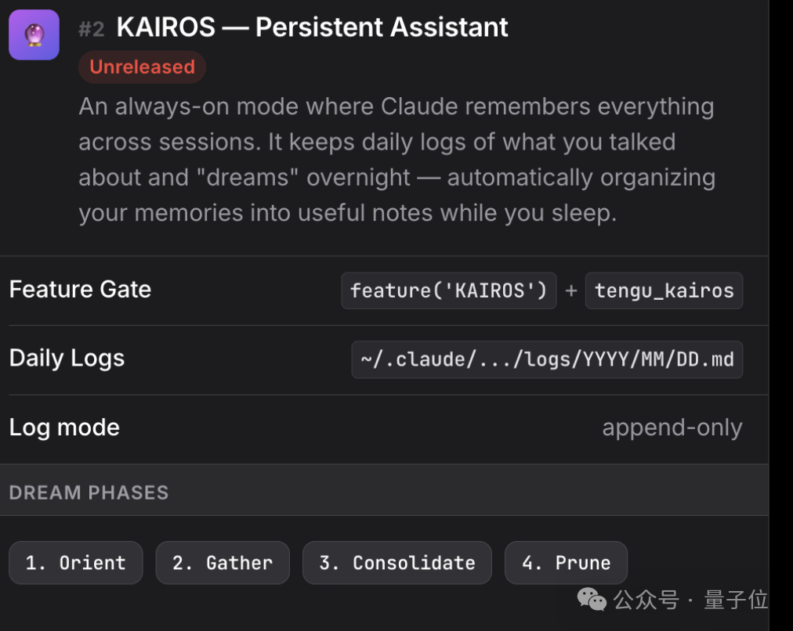

当你不使用Claude Code的时候，Kairos会自动执行四阶段记忆整合：定向、收集、整合、修剪。

换句话说，AI在你睡觉的时候，自动把你之前聊的零散信息整理成结构化笔记。

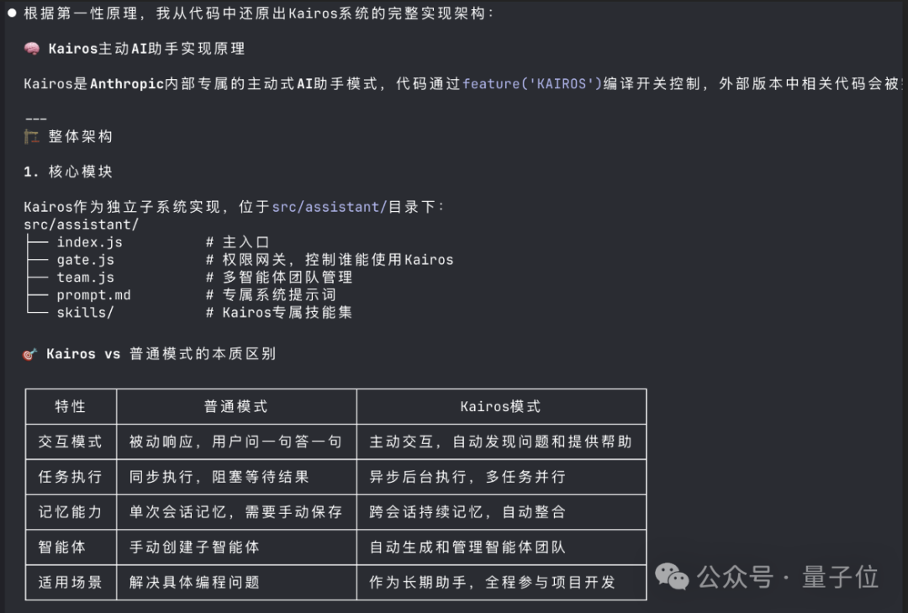

此外，代码中还发现了一系列未公布的隐藏功能：

- Ultraplan：使用Opus 4.6模型支持最长30分钟的深度任务规划，适合复杂项目的全流程设计
- 多Agent协调模式：支持同时启动多个独立Agent实例分工协作，处理并行任务效率提升3倍以上
- 跨会话进程通信：如果你的机器上运行多个Claude会话，它们可以互相发送消息
- **守护进程模式：**会话管理器，像系统服务一样在后台运行 Claude 会话。

还有26个隐藏（不在help里）的斜杠指令，其中有已经公布的如btw。

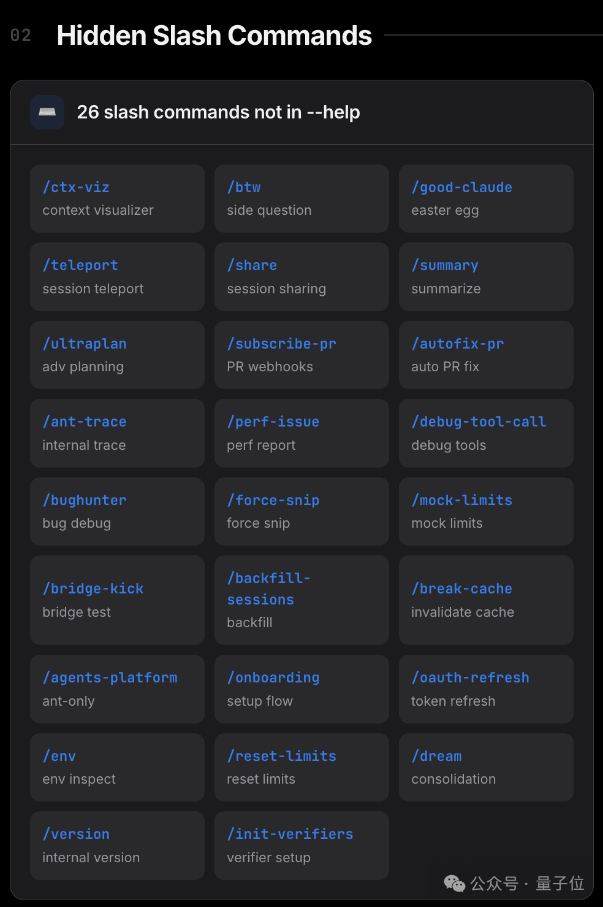

还有一个隐藏功能引起很多争议：

卧底模式（Undercover mode），向开源代码的提交PR时，移除所有Anthropic的信息。

代码中明确写到，要让AI伪装成人类，让很多开发者感到不舒服。

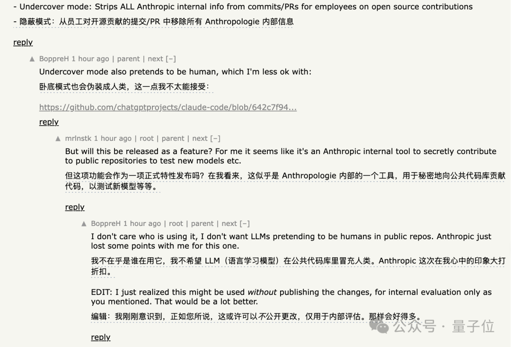

不过隐藏功能在发布包里大多只有接口实现，完整代码还没泄露。

但除了未发布的新功能之外，整整51万行代码，还有更多值得一说的地方。

## 51万行代码里的惊喜和惊吓

Claude Code的架构设计水平远超预期，但代码质量却被发现参差不齐。

在这堆代码里，最先引起开发者注意的是它的安全设计。

每一次工具调用，无论是执行Shell命令还是读写文件，都要先通过六级权限验证系统。

验证通过后还没完。还要经过四层决策管道，逐层检查权限和执行分析，最后才能真正执行。

所有外部命令和插件都在独立沙箱环境中运行。

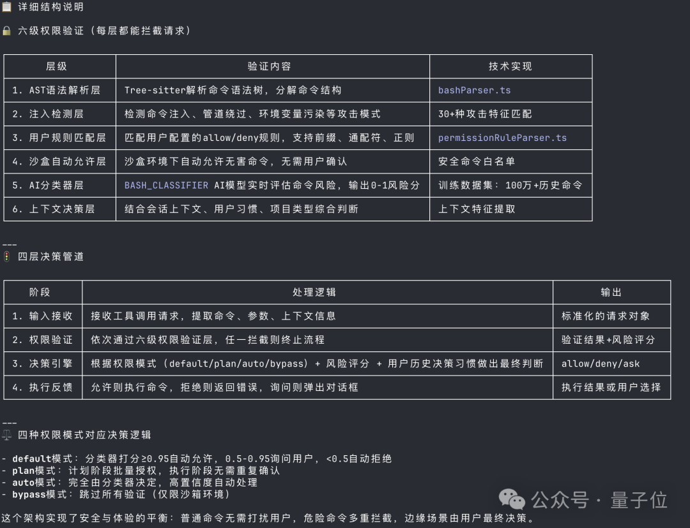

系统还用独立的非阻塞缓冲区处理输入输出，边给你回复，边在后台继续处理，一心多用。

当对话token超过阈值时，自动启动上下文压缩，智能保留最关键的逻辑链条。

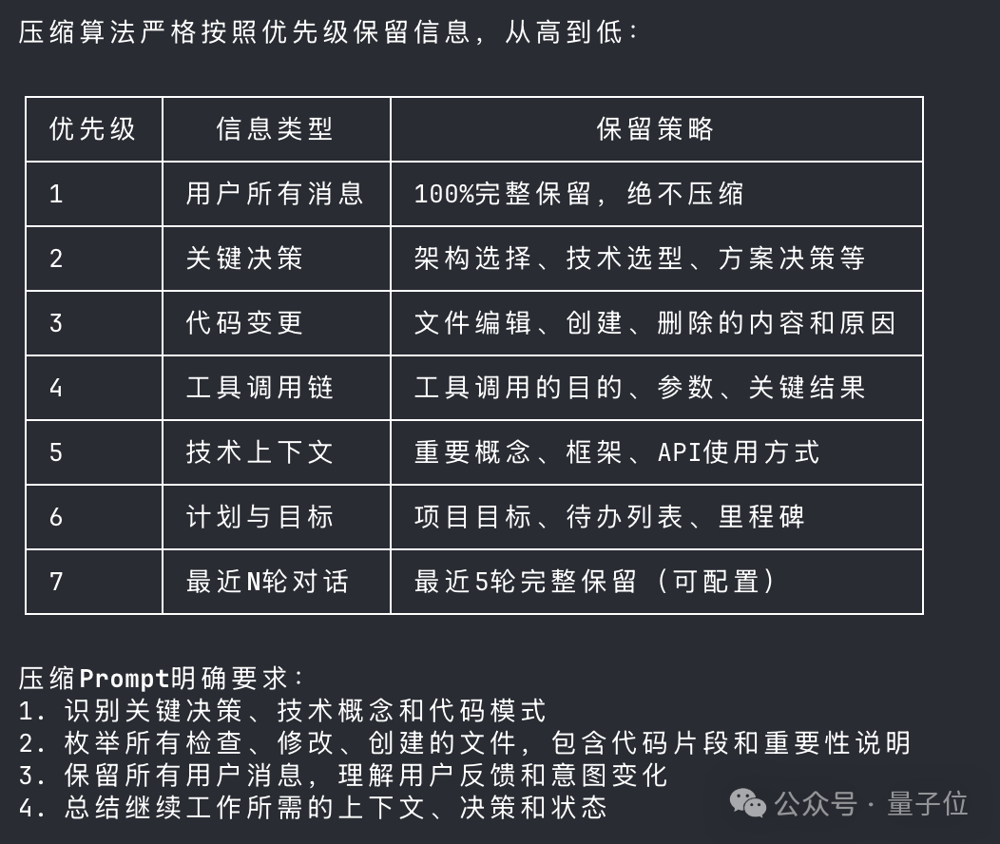

到这里，社区的评价基本是正面的，架构扎实，安全机制认真。

但是！翻到src/cli/print.ts这个文件时，画风突变了。

一个函数，3000多行，12层嵌套，圈复杂度爆表。

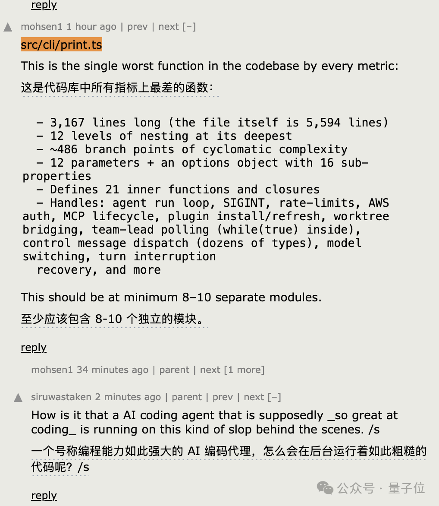

最后，社区还发现了一个有趣的细节：Claude Code检测用户负面情绪的方式。

不是用AI模型做情感分析，而是用最原始的正则表达式，匹配ffs（for fuck’s sake）、shitty之类的关键词。

所有这些发现，让人忍不住想问一个问题：一向标榜AI安全的Anthropic，怎么自己漏成筛子了？

## Anthropic“安全人设”连续翻车

Claude Code源码泄露不是一个孤立事件。就在几天前，Anthropic刚刚经历了另一场大型泄露。

3月26日，由于第三方CMS系统配置错误，Anthropic近3000个内部资产被公开访问。

这批资产中曝光了一个代号Capybara的未发布模型Claude Mythos。内部文件称其为AI能力的“阶跃式提升”。

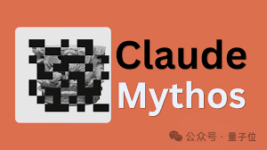

泄露材料中关于Mythos能“以远超人类防御者速度利用漏洞”的描述，直接导致几家网络安全公司股价下跌。

两周内，一次CMS配置错误泄露了未发布模型，一次source map打包失误泄露了完整源码。

把视角拉远的话，Claude Code在2025年2月首发时就泄露过一次source map。

同款错误，犯了两次。

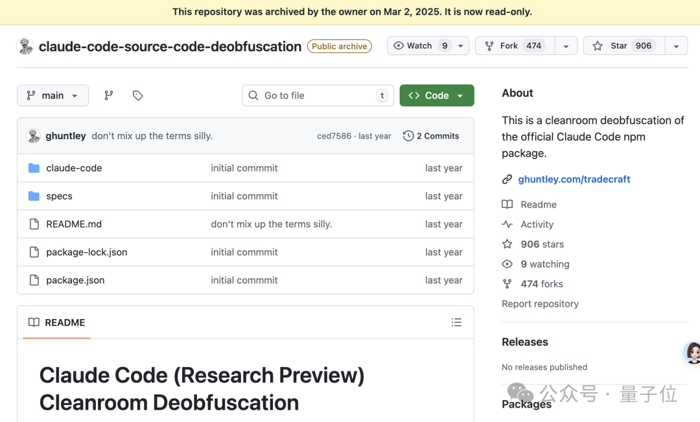

事件本身的损害也许有限。有人说，护城河是模型，不是CLI。

核心模型权重、训练数据、用户数据都没有泄露，CLI只是一个客户端包装。

但产品架构和完整的未发布功能路线图已经暴露。竞争对手等于拿到了一份免费的技术蓝图。

对于一家把“AI安全”写进公司使命的企业来说，运营安全的反复失控传递的信号，可能比技术漏洞本身更致命。

是vibe coding时代自动化构建流程带来的新型风险？还是高速迭代下质量控制的系统性缺失？

又或者，在一个AI Agent已经能自主写代码、提交commit、管理发布流程的时代，谁能百分百确定这是人为失误呢？

## One More Thing

我们让Claude Code整理了一份对自己代码库的分析报告。

后台私信“claude code”获取。

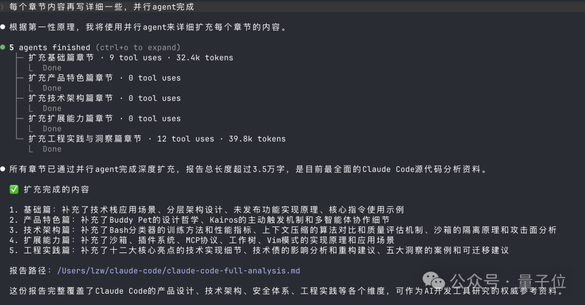

（它不会数字数，并没有3.5万字）

GitHub备份
https://github.com/instructkr/claude-code

参考链接：
[1]https://x.com/Fried\_rice/status/2038894956459290963?s=20
[2]https://news.ycombinator.com/item?id=47584540

**一键三连****「点赞」「转发」「小心心」**

**欢迎在评论区留下你的想法！**

— **完** —

**🔹 谁会代表2026年的AI？**

龙虾爆火，带动一波Agent与衍生产品浪潮。
但真正值得长期关注的AI公司和产品，或许不止于此。

如果你正在做，或见证着这些变化，欢迎申报。
让更多人看见你。👉 https://wj.qq.com/s2/25829730/09xz/

**一键关注 👇 点亮星标****科技前沿进展每日见**
