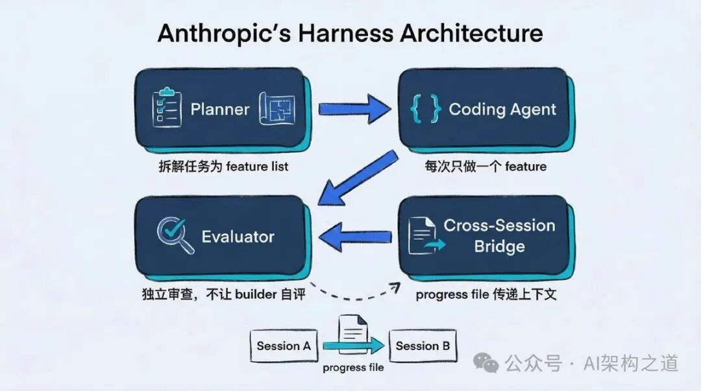
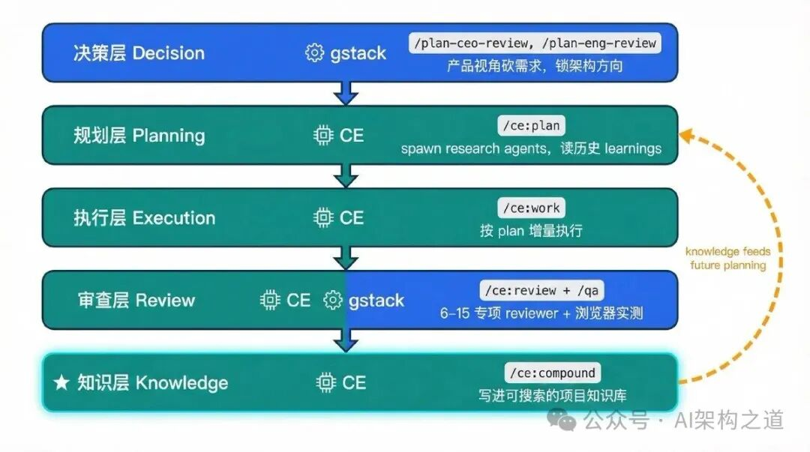

# 从决策、执行到记忆复利：gstack + Superpowers + CE 完整实战工作流

> 公众号: AI架构之道
> 发布时间: 2026-04-08 08:02
> 原文链接: https://mp.weixin.qq.com/s/PRWl8ZMZBXjciBy1Y_HqCw

---
在AI辅助编程普及的当下，Claude Code生态中三款工具持续领跑：YC CEO Garry Tan的gstack（66.2K ⭐，2026.4.7）[Claude Code 秒变 AI 创业团队，gstack 6 大角色一键召唤](https://mp.weixin.qq.com/s?__biz=MzIyOTY1ODAzNQ==&mid=2247484465&idx=1&sn=84697c027f962082acceb05c8b8b52e1&scene=21#wechat_redirect)Jesse Vincent的Superpowers（138.8K ⭐，2026.4.7）[Superpowers 让 AI 智能体写出工程级规范代码，开发效率拉满](https://mp.weixin.qq.com/s?__biz=MzIyOTY1ODAzNQ==&mid=2247484115&idx=1&sn=37209aaf47d4a7db4b9f7244d3160929&scene=21#wechat_redirect)Every Inc的Compound Engineering（CE）（13.5K ⭐，2026.4.7）
它们并非相互替代，而是覆盖AI开发全流程的三层互补体系。结合Anthropic官方Harness架构标准深度对比可见：高效AI开发，既需决策把关、流程规范，更离不开知识复利。

01评估基准Anthropic Harness架构Anthropic于2025年11月、2026年3月连续发布两篇工程博客，提出面向长周期AI Agent的Harness架构，成为衡量AI开发工具的权威标尺。其核心包含四大关键角色：

1. Planner Agent（规划器）：将复杂任务拆解为结构化、可验证的功能清单
2. Coding Agent（执行器）：单次聚焦单一功能开发，完成后留存结构化执行笔记
3. Evaluator Agent（评估器）：独立评审，严格分离“执行者”与“评价者”，避免自我高估
4. Cross Session Bridge(跨会话桥接)：通过外部状态文件传递上下文，保障多轮开发连贯不中断

该架构核心结论：生成与评估必须分离，独立评审可显著提升产出质量。依托此架构，Anthropic已实现Agent自主开发包含200+可验证功能的完整应用。

02gstackAI开发的决策与测试层[Claude Code 秒变 AI 创业团队，gstack 6 大角色一键召唤](https://mp.weixin.qq.com/s?__biz=MzIyOTY1ODAzNQ==&mid=2247484465&idx=1&sn=84697c027f962082acceb05c8b8b52e1&scene=21#wechat_redirect)gstack精准匹配Harness架构的规划+评估双核心，定位为“决策把关+真实测试”的顶层控制工具。

- 规划把关（双评审机制）：

- `/plan-ceo-review`：产品视角评审，判断需求价值、投入产出比，解决“是否值得做”

- `/plan-eng-review`：架构视角评审，校验技术风险、兼容性、扩展性，解决“是否会埋雷”

- 真实评估（浏览器端测试）：

`/qa`命令启动真实Chromium浏览器，模拟用户完成端到端交互测试（点击、输入、跳转、异常校验），而非仅静态代码审查。Anthropic论文证实：浏览器实测可大幅提升开发质量。Garry Tan公开数据：全职运营YC期间，60天产出60万行生产级代码（含35%测试），日均1–2万行。其短板明确：聚焦决策与测试，无结构化增量执行流程，无长效知识沉淀，定位为“把关层”而非“全流程层”。

03Superpowers标准化流程层[Superpowers 让 AI 智能体写出工程级规范代码，开发效率拉满](https://mp.weixin.qq.com/s?__biz=MzIyOTY1ODAzNQ==&mid=2247484115&idx=1&sn=37209aaf47d4a7db4b9f7244d3160929&scene=21#wechat_redirect)Superpowers以138.8K Star成为Claude Code标配，核心价值是将“随机对话”升级为“流程化开发”。

- 标准工作流：`brainstorm → plan → execute → review`，强制规范开发节奏

- 初步实现生成-评估分离：独立规格评审（spec-reviewer）+代码质量评审（code-quality-reviewer）

但对比CE存在三大硬伤：

1. 规划无历史支撑：仅基于当前会话上下文制定计划，不检索项目历史、Git记录、既往经验
2. 评审维度单一：仅2类评审，覆盖广度、深度不足
3. 无知识积累：会话结束即清空上下文，每次开发从零开始，无法复用经验

这正是其需要结合CE的核心原因：有流程、无记忆，无法形成复利。

04Compound Engineering知识复利核心层CE在Superpowers流程基础上完成质的升级，新增`compound`核心环节，填补AI开发“知识沉淀”空白，实现开发效率指数级增长。

1. 规划：基于全量历史的深度规划`/ce:plan`并行启动研究Agent，自动完成：

- 检索项目历史文档、Git提交记录、既往PR

- 匹配同类功能实现模式、踩坑记录

- 从`docs/solutions/`知识库调取过往经验

- 输出结构化、可追踪、风险前置的执行计划

2. 评审：6–15个专项评审团（动态扩展）`/ce:review`启动动态评审机制：

- 基础常驻评审（≥6类）：正确性、安全性、性能、可测试性、可维护性、对抗性（50行+diff触发）

- 扩展评审：学习研究、项目规范、代码风格、边界校验等

- 每个评审独立出具P0–P3优先级问题清单，闭环修复

3. 核心创新：/ce:compound（知识复利引擎）完成功能开发或Bug修复后，执行`/ce:compound`，并行启动5大子Agent完成结构化知识沉淀：

1. 上下文分析器：回溯全会话，提取问题类型、关联组件、症状表现
2. 方案提取器：梳理无效尝试、有效解法、根因分析、最终代码
3. 关联文档查找器：查重`docs/solutions/`，更新旧文档、不重复创建
4. 预防策略师：制定同类问题规避方案、最佳实践
5. 分类器：自动打标、分类存储，支持全文检索

最终生成标准化知识库文档（含YAML元数据），存入`docs/solutions/`。

- Anthropic progress file：线性交接备忘录，仅服务相邻会话

- CE知识库：永续项目记忆，所有未来会话均可检索复用

核心差异：备忘录解决“连续性”，知识库解决“积累性”——线性传递 vs 指数复利。这正是“Compound”的本质：每一次开发，产出不仅是代码，更是可复用的项目经验，越用越高效。

05三层工具协同完整AI开发工作流三款工具无功能冲突、分层互补，组合覆盖Harness架构全角色：

- 决策层：gstack（产品+架构双评审，把控方向）

- 规划层：CE /ce:plan（依托历史经验，制定精准计划）

- 执行层：CE /ce:work（单功能增量开发，可中断恢复）

- 评审层：CE专项评审 + gstack /qa（代码深度评审+浏览器真实测试）

- 知识层：CE /ce:compound（沉淀永续知识库，避免重复踩坑）

06落地实操

1. 需求深度确认（避免方向偏差）执行AI反向访谈，锁定真实需求（非表面需求）：I'm about to start this project. Interview me until you have 95% confidence about what I actually want, not what I think I should want.AI通过多轮提问明确：业务目标、用户场景、边界条件、非功能需求、验收标准，确保需求收敛。

2. 项目启动与对齐（gstack）执行`/office-hours`，进入项目沟通模式：

- 完整描述项目背景、阶段、资源约束、预期产出

- AI初步梳理任务范围、识别高风险点、暴露沟通缺口

- 完成团队认知对齐，避免后期返工

3. 产品维度评审（gstack）执行`/plan-ceo-review`，产品视角把关：

- 校验需求是否符合产品路线图、优先级是否合理

- 评估投入产出比、剔除需求镀金、收缩非核心范围

- 评审通过方可进入技术规划，不做“无效开发”

4. 技术架构评审（gstack）执行`/plan-eng-review`，工程视角风险校验：

- 评估技术方案兼容性、性能/稳定性/扩展性隐患

- 校验依赖服务、数据结构、接口设计合理性

- 规避技术债、确认架构方向，避免后期大规模重构

5. 方案脑暴与规格细化（CE）执行`/ce:brainstorm`，多方案研讨：

- 输出≥2种实现路径，对比复杂度、开发量、风险、可维护性

- 收敛为清晰、可执行、无歧义的需求规格（spec）

- 为后续规划提供明确依据，不模糊开发

6. 基于历史经验的详细规划（CE）执行`/ce:plan`，深度规划阶段：

- 研究Agent自动检索项目历史、Git记录、`docs/solutions/`知识库

- 匹配既往经验、标注踩坑点、规避已知问题

- 拆分为细粒度任务清单，明确依赖、顺序、验收标准、交付物

- 输出结构化执行计划，可追踪、可接管、可中断恢复

7. 增量开发与任务执行（CE）执行`/ce:work`，按计划推进：

- 严格遵循单功能迭代，不并行多任务

- 每完成一子任务自动生成结构化笔记、同步进度

- 实时标记阻塞点、待确认问题、依赖项

- 保持代码风格、目录结构、命名规范统一

8. 多维度专项评审（CE）执行`/ce:review`，启动评审团：

- 基础6类评审+扩展评审（按diff规模动态激活）

- 每个评审出具独立报告，标注问题等级、修复建议

- 逐一修复闭环，确保代码质量、安全性、性能、可维护性达标

9. 浏览器端真实体验测试（gstack）执行`/qa`，真实环境验收：

- 启动浏览器访问测试环境，模拟用户全流程操作

- 校验UI交互、接口响应、页面加载、异常提示、兼容性

- 复现核心流程+边界场景，不依赖“代码看起来正确”

- 确保功能在真实环境可用、稳定、无体验漏洞

10. 知识沉淀与复利积累（CE）执行`/ce:compound`，本轮开发最关键一步：

- 5大子Agent并行提取全会话经验、结构化沉淀

- 生成标准化文档存入`docs/solutions/`，自动分类、打标、检索

- 形成永续项目记忆，下次开发自动调取，避免重复踩坑

- 实现“开发一次、经验永久复用”的复利效应

11. 版本整理与交付

- 修复所有评审/测试问题，整理Commit信息、更新CHANGELOG

- 执行代码合并、部署、发布，完成开发闭环

- 下一次启动时，CE自动读取本次沉淀经验，从源头减少试错

07总结gstack、Superpowers、CE并非竞品，而是AI开发的三层核心能力：

- gstack：解决“做对的事”（决策把关、真实测试）

- Superpowers：解决“做事有规范”（流程标准化、基础评审）

- CE：解决“持续高效做事”（深度规划、多维评审、知识复利）

单一工具无法覆盖全场景，组合使用可让AI Agent在开发中持续沉淀经验、避免重复踩坑、效率指数级提升。对于追求长效价值的开发者：/ce:compound所带来的知识复利，正是AI开发突破效率瓶颈的核心关键——你的Agent每天写代码、改Bug，而真正的价值，是让它把学到的东西永久留下来。开源地址：
> https://github.com/EveryInc/compound-engineering-plugin

07扩展阅读

- [Claude Code 团队落地指南：一套可复制的 配置方案](https://mp.weixin.qq.com/s?__biz=MzIyOTY1ODAzNQ==&mid=2247483982&idx=1&sn=58da4f4077c967bfffcd7045ba767bb0&scene=21#wechat_redirect)
- [开源5天斩获 20K+ Star！遵循 Google 官方格式，一键复用大厂设计！](https://mp.weixin.qq.com/s?__biz=MzIyOTY1ODAzNQ==&mid=2247484786&idx=1&sn=1ff822467d08a9b8b8a66edcc1fe53d6&scene=21#wechat_redirect)
- [炼化同事、反蒸馏、老板、自己……全都被封装成AI插件](https://mp.weixin.qq.com/s?__biz=MzIyOTY1ODAzNQ==&mid=2247484768&idx=1&sn=69c31a511d1f9d47a767497f7f4f3edf&scene=21#wechat_redirect)
- [史上最快突破 100K+ 星标！Claw Code 开源解析！](https://mp.weixin.qq.com/s?__biz=MzIyOTY1ODAzNQ==&mid=2247484715&idx=1&sn=a22d76cc9007554cd849c83eef3b47b3&scene=21#wechat_redirect)
- [PDF解析痛点破解！这款开源神器，全球第一且免费可用](https://mp.weixin.qq.com/s?__biz=MzIyOTY1ODAzNQ==&mid=2247484742&idx=1&sn=4fd1cc85fb1ca9e91dd162c6a8a3f913&scene=21#wechat_redirect)
- [20K+ Star！Claude Code 多智能体编排神器！](https://mp.weixin.qq.com/s?__biz=MzIyOTY1ODAzNQ==&mid=2247484706&idx=1&sn=40772ef22d7bbc8f775315c09127bc17&scene=21#wechat_redirect)
- [16.8K+ Star！会自我成长的开源AI智能体](https://mp.weixin.qq.com/s?__biz=MzIyOTY1ODAzNQ==&mid=2247484678&idx=1&sn=19aecc0f841d0083205f8bb7d85cd252&scene=21#wechat_redirect)
- [Claude Code 专属仪表盘！3 条命令安装](https://mp.weixin.qq.com/s?__biz=MzIyOTY1ODAzNQ==&mid=2247484637&idx=1&sn=49e484433dddcd2aa70997d454676556&scene=21#wechat_redirect)

- [碾压设计工具！52K+星标！程序员零设计也能秒出专业UI](https://mp.weixin.qq.com/s?__biz=MzIyOTY1ODAzNQ==&mid=2247484658&idx=1&sn=659d0b53312b98c52060c37faafb9436&scene=21#wechat_redirect)
- [字节版龙虾开源斩获 37.5K+ 星标！飞书原生适配](https://mp.weixin.qq.com/s?__biz=MzIyOTY1ODAzNQ==&mid=2247484584&idx=1&sn=bc1166456c4c4b57601980ac9e920c8f&scene=21#wechat_redirect)

- [4 天狂揽 20K+ 星标！带你从 0 到 1 手撸Claude Code](https://mp.weixin.qq.com/s?__biz=MzIyOTY1ODAzNQ==&mid=2247484532&idx=1&sn=d90060cb13dc5df6cd1d9b72b219c32c&scene=21#wechat_redirect)
- [上周突破 8K+星标，让 OpenClaw Token 成本狂降 96%](https://mp.weixin.qq.com/s?__biz=MzIyOTY1ODAzNQ==&mid=2247484500&idx=1&sn=75efac13309ab6c291b7adae6d558e9f&scene=21#wechat_redirect)

- [上线48小时狂揽 10K+ 星标，Claude Code 秒变 AI 创业团队](https://mp.weixin.qq.com/s?__biz=MzIyOTY1ODAzNQ==&mid=2247484465&idx=1&sn=84697c027f962082acceb05c8b8b52e1&scene=21#wechat_redirect)
- [74k Star爆火！Superpowers 让 AI 智能体写出工程级规范代码](https://mp.weixin.qq.com/s?__biz=MzIyOTY1ODAzNQ==&mid=2247484115&idx=1&sn=37209aaf47d4a7db4b9f7244d3160929&scene=21#wechat_redirect)

关注我持续分享高质量内容

终身学习，深耕AI领域

持续分享，优质AI开源

欢迎关注，携手AI同行