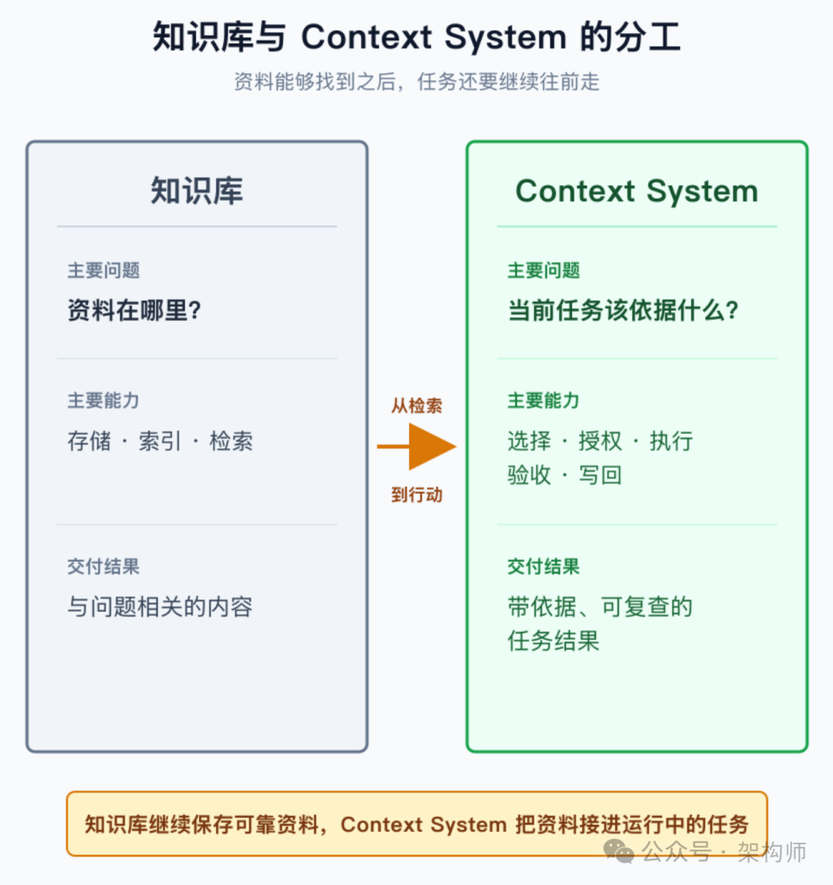
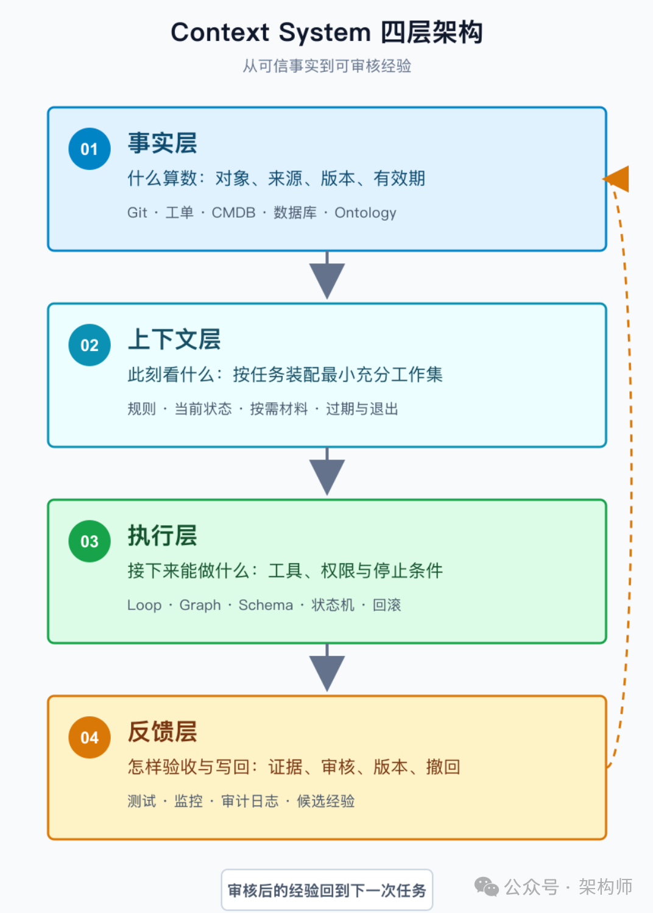
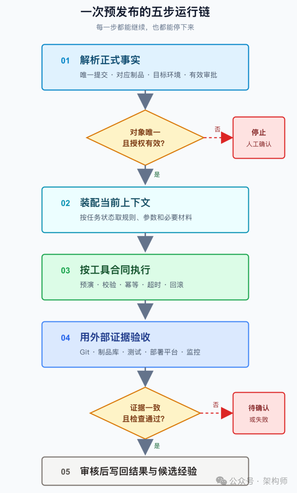

# Context System 架构拆解：让 Agent 从“找到资料”走到“可靠行动”

> 公众号: 架构师
> 发布时间: 2026-08-11 22:53:22
> 原文链接: https://mp.weixin.qq.com/s/vh2SWPlZIATW2ubSNkpl1Q

---


架构师（JiaGouX）我们都是架构师！
架构未来，你来不来？

“把这个版本发到预发布环境。”

当你跟搭档说这句话时，他通常会顺手补齐不少背景：这个版本指哪个提交，预发布是哪套环境，谁批准了变更，哪些检查不能省，出了问题去哪里看。

换成 Agent，事情就没这么顺了。人和人之间那些默认的共识，到了系统里，都得变成可读取、可判断、可验证的能力才行。

资料往往并不缺，发布规范在文档里，代码也在 Git 里，制品在仓库里，审批在工单里，服务状态在监控里。麻烦在于：**资料都在，Agent 仍可能不知道哪一份算数、此刻该取哪几条，以及做到什么程度才算完成。**

过去几个月，我们陆续讨论过[上下文工作集](https://mp.weixin.qq.com/s?__biz=MzAwNjQwNzU2NQ==&mid=2650409162&idx=1&sn=62556a10e227bcb8d977a4f3e0006c8b&scene=21#wechat_redirect)、过程资产、[Agent Loop](https://mp.weixin.qq.com/s?__biz=MzAwNjQwNzU2NQ==&mid=2650409948&idx=1&sn=cfe8a886980e4377bcf5dfaea6369ed2&scene=21#wechat_redirect)、[Graph Engineering](https://mp.weixin.qq.com/s?__biz=MzAwNjQwNzU2NQ==&mid=2650409948&idx=1&sn=cfe8a886980e4377bcf5dfaea6369ed2&scene=21#wechat_redirect) 和 [Ontology](https://mp.weixin.qq.com/s?__biz=MzAwNjQwNzU2NQ==&mid=2650410012&idx=1&sn=efa78c5a0346d7d297e739c1b4da7dd5&scene=21#wechat_redirect)。把这些话题放到同一条任务里，我越来越关心的是：Agent 怎样找到此刻真正有用的事实，又怎样在受控的前提下行动，最后还能把结果说清楚。

为了后面方便讨论，我暂且把承载这组能力的工程系统叫作 **Context System**。这里说的 Context，已经不只是提示词和记忆，任务当下依赖的事实、规则、状态、工具和证据都在其中。

先看它和知识库怎样分工。

图 1：知识库与 Context System 的分工

知识库仍然是事实的重要来源。Context System 不打算替代它，只是接着往前多走几步，直到任务有结果，也有证据可查。

沿着这条运行链，我试着把 Context System 拆成四层：

图 2：Context System 四层架构

**事实层确认什么算数，上下文层决定此刻看什么，执行层管住接下来能做什么，反馈层用证据验收，并把可复用经验送回系统。**

这张图很容易让人以为，四层就是四套新平台。其实原有的知识库、Git、工单和监控都不用推倒重来，Context System 更像是一份跨系统的运行约定。它把散在各处的事实、权限和结果连进同一条任务，Agent 才知道下一步去哪里查，做完又该去哪里核验。

---

## 先把四层放进同一条任务

### 事实层：先找到能拍板的事实

Agent 搜到一段内容，只能说明它和问题有关。这段内容能不能影响当前动作，还得看它从哪里来、对应哪个版本，现在是否仍然有效。

比如，去年的事故复盘和今天的环境配置，都可能命中“预发布失败”。前者能帮忙找线索，后者才代表环境现状。群里那句“这次可以跳过”即使写得很明白，也不能自动覆盖正式发布规则。

所以在事实层，我会先问一句：遇到冲突时，到底哪一份记录能拍板？

要回答这个问题，关键对象得有稳定标识，来源和维护人也要跟着记录。它在哪个项目和环境生效、什么时候过期，最好成为数据本身的一部分。等两份记录打架时，系统才有依据决定是继续，还是停下来找人确认。

前几天聊 [Ontology](https://mp.weixin.qq.com/s?__biz=MzAwNjQwNzU2NQ==&mid=2650410012&idx=1&sn=efa78c5a0346d7d297e739c1b4da7dd5&scene=21#wechat_redirect) 时，我们把对象、关系、状态和约束单独拆了出来。放到 Context System 里，它正好补上事实层的语义：知识库和数据库负责保存记录，Ontology 说清这些记录表达的是什么。这样一来，系统才分得清“候选版本”“已批准版本”和“已部署版本”。

起步时不一定需要图数据库。一张关系表、几份 YAML，或者已有 CMDB，都可以先跑起来。真正难改的是含糊的语义，因为它会顺着自动化流程一路传下去。

### 上下文层：只把眼前有用的东西拿上桌

我更习惯把上下文窗口理解成 Agent 眼前的工作台。

昨天聊[Anthropic 的上下文工程](https://mp.weixin.qq.com/s?__biz=MzAwNjQwNzU2NQ==&mid=2650410033&idx=1&sn=8ba5a4845556b5983ad733613f9deb74&scene=21#wechat_redirect)时，讨论的正是这块工作台怎样随任务变化。长窗口确实能装下更多东西，但旧规则、相邻项目的配置，还有几个月前的日志，放在一起都显得“相关”。真到下一步，这些内容未必都有用。

Anthropic 对 Context Engineering 的描述里，我最在意的是“持续”二字。上下文不是在任务开始时装一次就结束了。工具返回新结果，任务状态跟着变，下一轮的工作集也该重新选。

放回预发布的场景就很直观。刚接到任务时，Agent 先看目标环境、候选版本和当前授权。准备执行了，才需要把工具参数、禁止项和停止条件拿进来。真出了异常，再翻日志、变更记录和事故经验。到验收时，前面那些材料可以暂时放下，注意力要回到本轮证据和目标环境上。

这就是我理解的“最小充分工作集”。眼前的东西够用就好，用不到的先留在窗口外，真需要时还能找得回来。

OpenAI 在 Codex 的内部工程实践中，用较短的 `AGENTS.md` 当地图，详细的架构、计划和产品文档继续放在更深的目录里。入口只负责指路，不复制整本说明书。他们提到的“约 100 行”只是当时的实践量级，用不着把它变成一条通用上限。

### 执行层：模型做判断，系统守边界

信息选对了，Agent 才到真正动手的时候。它看一眼当前状态，选一个动作，调用工具，再根据结果继续或停下。这就是 Agent Loop 最基本的节奏。

短任务通常一个 Loop 就够。等任务跨过研发、测试和发布，Graph 才开始有价值，因为节点、依赖、分支和交接终于可以被明确地画出来。前面聊 Loop 和 Graph Engineering 时，我们专门区分过执行图和事实图。前者组织任务怎么跑，后者记录任务依据什么，两张图可以互相引用，但不该混成一种状态。

到这一层，提示词只能管一小部分。项目、版本和环境要在输入时说明白，不能让默认值替 Agent 猜。查看信息和真正执行变更也要分开授权，回滚入口则应当在动作发生前就准备好。

超时和重试可以交给工具处理，幂等与并发冲突则由状态机或底层系统兜住。工具返回时，别只给一句“成功”，还要说明影响了什么，并给出证据位置。没做完的部分也要如实留下。

这里最容易被一句“执行成功”带过去。退出码为 0，只能证明命令正常结束。制品是不是对的，服务是不是健康，流量有没有落到预期版本，都还要另外查证。

权限也是一样。提示词可以告诉 Agent 边界在哪里，但真碰到越权调用，光靠模型“自觉”不够。真正的拒绝和审批必须由工具与权限系统执行；涉及状态和数据的限制，再落到底层约束里。

### 反馈层：结果先留证据，经验晚一点写

一次任务结束后，我会把留下来的东西分成两摊。一摊是运行证据，用来说明这次到底做成没有；另一摊是可能复用的经验，它会影响以后怎么做。

运行证据要能沿着任务一路查回去：Agent 看过哪些来源，依据哪条规则，调用了什么工具，目标系统后来发生了什么。回到预发布，候选提交要和制品对得上，目标环境要真的出现预期版本，健康探针也得正常。这几处证据能互相印证，“已完成”才比较可信。

经验就不能这么快往里写了。

4 月聊 [Hermes Skills](https://mp.weixin.qq.com/s?__biz=MzAwNjQwNzU2NQ==&mid=2650409130&idx=1&sn=29576ecf2bb5e765e21d4d42ff6d284e&scene=21#wechat_redirect) 和过程资产时，我们把几类容易混在一起的东西拆开过。环境和约定属于事实记忆，过去发生了什么可以去会话里检索。Skill、Runbook 和 Checklist 更进一步，它们会直接影响这类任务以后怎么做，更新门槛自然不能和任务记录一样。

一次失败日志可以进入任务记录，一条临时安排可以随任务归档。只有经过复现、确认适用范围和审核的做法，才适合进入长期过程资产。**聊天记录留下的是这次发生的事，过程资产却会改变下次怎么做。后者写入前，必须经过核验和发布。**

OWASP Agent Memory Guard 项目正在关注这类风险。它把跨会话、运行时可写的 Agent 记忆视为持久化攻击面，并开始探索完整性检查、策略、快照和回滚。这个项目还在演进，目前不适合当成成熟的统一标准。不过，错误内容一旦进入长期层，影响就不会随着当前任务一起结束。

所以，写回路径先做得朴素一点就好：

**候选经验 → 复现与核验 → 责任人审核 → 发布 → 可撤回**

Agent 可以整理候选、附上证据，也可以提示冲突，但不要顺手把发布权一起交给它。正式事实、长期规则和高风险动作原本就可能归不同责任人管理，授权也该分开。

---

## 把这套架构真正跑一遍

图画完还不够。真的把“这个版本发到预发布”丢给 Context System，前面四层会沿着下面这条链路反复配合：

图 3：一次预发布经过 Context System 的五步运行链

### 先把“这个版本”说清楚

系统第一件事，是把“这个版本”和“预发布”换成稳定对象。哪个提交，对应哪份制品，目标环境和发布规则分别是什么，审批现在还有没有效，都要有确定答案。候选版本不唯一，或者授权已经失效，这时候停下来问人，比自己补齐答案更可靠。

### 每往前一步，重新拿一次上下文

准备预演、正在部署和等待验收，需要的东西不一样。日志、历史事故和大段文档不用一开始全部带上，真遇到问题再展开。环境状态这类会变的事实，则要带上版本或时间，免得 Agent 下一步还在用旧结果。

### 动手之前，先看边界

Agent 先做一次变更预览，确认目标和影响范围，再调用已授权的工具。参数不合法或权限不够，工具应当直接拒绝；重复调用和并发冲突，也别留给模型自行判断。Agent 根据结构化结果决定下一步，必要检查没过，流程就停下来，视情况补偿或交给人处理。

### 让系统来证明结果

验收时，不听 Agent 自己说“我已经完成”。Git、制品库、测试系统、部署平台和监控，谁掌握结果，就去谁那里取证。几处证据对不上，任务就留在“待确认”或“失败”，没必要急着生成一份看起来很完整的成功报告。

### 新经验先进候选区

这次发布的结果可以直接进任务记录，原始证据保留好定位。但新发现的做法，先只能算候选经验。它要带上来源、适用版本和复现步骤，等核验通过，再去更新发布清单或过程资产。以后发现它不再适用，也应当能撤回，并且查得到影响过哪些任务。

这五步看起来不复杂，但任何一处断掉，都会在后面留下痕迹。开头没把对象说清，后面可能整条链都在发错版本。验收没拿到外部证据，一次误判就可能被写成成功。更麻烦的是，这个误判如果又被写回长期资产，它还会影响下一次任务。

---

## 真要落地，先选一条小链

讲到这里，Context System 听起来已经很大了。但真要做，我不会从“先建一个平台”开始。

预发布核验就是一个不错的入口。它的目标相对明确，证据能回查，出问题也容易停下来。生产告警初查和 PR 合规检查也有类似特征。第一阶段甚至可以只做只读核验，暂时不开放自动写入。

如果从预发布核验起步，我会先准备几份很薄的资产。

先画一张来源地图。关键对象从哪里来、由谁维护，记录冲突时按什么规则处理，先用一页纸说清楚。它不必完整覆盖所有系统，能支撑这条任务就够了。

有了地图，再写一份上下文配方。它不用很复杂，先把必读信息和停止条件列出来，验收时需要哪些证据也一并写进去。

```
任务：预发布核验

必须读取：
  - 当前发布规则
  - 候选版本清单
  - 目标环境状态

按需读取：
  - 对应事故复盘
  - 深层日志和历史变更

停止条件：
  - 授权缺失
  - 候选版本不唯一
  - 必要检查未通过

验收证据：
  - 提交与制品对应关系
  - 构建和测试结果
  - 目标环境版本与健康状态
```

先用 YAML、JSON 或现有工作流配置表达就够了，这时候还没有必要发明新的 DSL。

接着把工具合同补齐。输入 Schema 和权限要明确，预演与真正执行分开；超时、错误码和回滚入口，也要让调用方拿得到。该由工具保证的事，就不要留给模型临场发挥。

我还会专门准备几个失败样本，不急着只测顺利发布。比如同时出现两个候选版本，或者审批刚好过期；也可以让部署回执显示成功，同时让健康检查失败。跑这些样本，更容易看出系统该停时能不能停，事后还能不能查到依据。

起步阶段，指标也不用铺得很开。先看来源有没有取错、验收证据是否完整。遇到冲突时能不能及时停下来，甚至比速度更值得关注。只读链稳定以后，再慢慢开放范围小、可以审核和撤回的写操作。到了那一步，再看候选经验的通过率更有意义。

第一条链跑起来后，收益不一定马上体现在速度上。但问题究竟出在事实、上下文、工具，还是治理规则，通常会比以前清楚得多。

---

## 写在最后

知识库当然还要继续做。没有稳定的文档、索引和版本管理，Context System 也找不到可靠的事实。

Agent 一旦进入研发、运维和业务流程，还需要补上运行时的那一层。知识不只要能找到，还要能判断是否适用于当前任务；动作完成以后，结果也得回到外部系统核验。至于新经验，宁可晚一点写，也别未经确认就进入长期层。

前面几个月谈到的上下文工作集、过程资产、Loop、Graph 和 Ontology，各自解决的范围并不相同。Context System 这个视角的价值，是把它们重新放回一条能运行、也能复查的任务链里。

团队也不必一次把四层做齐。先选一条高频任务跑起来，能回查来源，也能在越过边界前停住。做过几轮以后，最缺哪一层，往往会自己露出来。

**知识可以慢慢积累。对今天的 Agent 系统来说，我更在意每一次行动能不能说清依据，也经得起复查。**

## 参考资料

- • Anthropic Applied AI Team，Effective context engineering for AI agents，2025-09-29
- • Ryan Lopopolo，OpenAI，Harness engineering: leveraging Codex in an internal beta，2026-02-11
- • OWASP Agent Memory Guard 项目页


如喜欢本文，请点击右上角，把文章分享到朋友圈
如有想了解学习的技术点，请留言给若飞安排分享

**因公众号更改推送规则，请点“在看”并加“星标”第一时间获取精彩技术分享**

**·END·**

```
```
相关阅读：


- Loop Engineering，应该赞成还是反对？
- Claude 做方案，Codex 写代码：多模型协作怎么交接才稳


- 架构排熵：Loop Engineering 的持续清理系统
- Claude Code 27 条实用技巧，快速升级
- 我终于搞明白了：Claude Code 为什么会忽略指令了
- Loop 工程实战：从任务循环到可维护闭环
- CLAUDE.md 拆解：Agent 进仓库前的上下文入口
- Claude、Codex、Mira 都在讲 Loop，架构师更该看什么
- 如何用 Claude Code 搭建自己的 AI 学习系统
- Anthropic CEO 核心访谈：AI时代，企业、职场与治理
- Loop详解：从ReAct到Loop Engineering，Agent到底在循环什么
- Harness工程还没唱罢，Environment工程已然登场
- 设计Self-Harness架构：会自我改进的Harness
- Fable 5 的信号：Agent 开始拼 Runtime
- Anthropic工程师：我们日常如何使用Claude Code
```
```

> 版权申明：内容来源网络，仅供学习研究，版权归原创者所有。如有侵权烦请告知，我们会立即删除并表示歉意。谢谢!

**架构师**

我们都是架构师！


****关注**架构师(JiaGouX)，添加“星标”**

**获取每天技术干货，一起成为牛逼架构师**

**技术群请****加若飞：****1321113940****进架构师群**

投稿、合作、版权等邮箱：**admin@137x.com**

